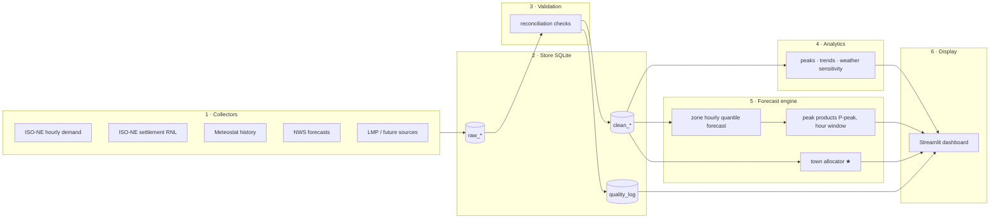

# PeakWatch Architecture

## Design rules

1. **Modules talk only through the database.** Every module reads tables and
   writes tables. No module imports another's internals. Any module can be
   rewritten, broken, or half-finished without breaking the others — the
   contract is the table schema, not the code.
2. **Nothing is promoted without validation.** Data moves raw → clean →
   features → forecasts, and each promotion runs reconciliation checks against
   independent published numbers. Failing data stays quarantined and the
   dashboard says so.
3. **Every forecast has a benchmark and a score.** ISO-NE's own day-ahead
   cleared demand is the benchmark; a forecast that can't beat it gets
   replaced by it. Scores are stored, not remembered.

## Modules



Orchestration (module 7, "piping") is one CLI:

```
py -m peakwatch refresh     # run all collectors (idempotent, rate-limit aware)
py -m peakwatch validate    # reconciliation checks; promote or quarantine
py -m peakwatch forecast    # retrain/score, write forecast tables
py -m peakwatch report      # scorecard: forecast vs benchmark vs actuals
```

Each command is a DAG stage; Windows Task Scheduler can run `refresh
validate forecast` daily. Recalculation is therefore built in: new data →
same pipeline → refreshed outputs, no manual steps.

## Store (SQLite: `peakwatch.db`)

| Table | Grain | Source module |
|---|---|---|
| `raw_zone_demand` | zone-hour | collector |
| `raw_town_rnl` | town-month | collector |
| `raw_weather` / `raw_weather_fcst` | town-hour | collector |
| `clean_zone_demand` | zone-hour, validated | validation |
| `clean_town_rnl` | town-month, validated | validation |
| `quality_log` | check-run | validation |
| `analytics_peaks` | zone-month | analytics |
| `forecast_zone_hourly` | zone-hour-quantile-rundate | forecast |
| `forecast_peak_daily` | zone-day-rundate | forecast |
| `town_hourly_est` | town-hour + version | town allocator |
| `forecast_scorecard` | model-period | report |

SQLite because the data is small (~10⁵ rows/table), zero-ops, and one file.
If analytics outgrow it, DuckDB reads the same tables.

## Forecast engine (module 5)

**A peak flag is not a forecast.** The core product is the hourly load
distribution; peak calls fall out of it.

- **5a. Zone hourly forecast, horizon 1–7 days.** Features: NWS forecast
  temperature/humidity (town-weighted per zone), calendar, lags, solar proxy.
  Model: gradient boosting per zone, trained on `clean_zone_demand` +
  `raw_weather`. Quantile losses give p10/p50/p90.
- **5b. Peak products.** From the quantile paths: P(day d sets the monthly
  max), predicted peak hour window, margin vs month-to-date max, days of
  runway left in the month. The old threshold rule stays as the baseline.
- **5c. Town allocator ★ (the crown jewel).**

### 5c: regional → town conversion

The settlement report gives each town one real number per month: its MW
**at the monthly transmission peak hour** (RNL). That is an anchor, not a
curve. The allocator turns zone curves into town curves:

```
town_load(h) ≈ α_town(m) · zone_load(h) · shape_adj(town, h)
```

- `α_town(m)`: calibrated so the town's estimated load at the zone's actual
  peak hour of month m matches the published RNL of month m.
- `shape_adj`: per-town correction from town weather sensitivity and customer
  mix (Chicopee industrial ≠ Marblehead residential); starts at 1.0 in v0.
- **Honest validation loop:** every month we publish our *prediction* of each
  town's next RNL before ISO-NE releases the report (~2-month lag), then score
  it. Rolling per-town MAPE goes in `forecast_scorecard`. The model earns
  trust by calling numbers before they're published — or it doesn't.
- Coincidence factor per town (own-peak vs zone-peak timing) is a first-class
  analytics output: it tells each town how much of its bill is *shaveable*.

## Display (module 6)

Streamlit reads **only** from the store — no live API calls in the app.
Tabs: Peak Risk (today), Zones, **Towns** (settlement history, trend,
next-month RNL prediction vs actual once published), Data Health
(quality_log + scorecard). "Resources" page links sources and docs.

## Migration map (current code → modules)

| Existing | Becomes |
|---|---|
| `scripts/ingest_load.py` | collector: zone demand |
| `scripts/ingest_town_load.py` | collector: settlement RNL |
| `scripts/ingest_weather.py` | collectors: weather + forecast |
| `scripts/sanity_report.py` | validation module |
| `peakwatch/peaks.py` | analytics + forecast 5b baseline |
| `app.py` | display (drop its live API call) |
| — new — | store.py, allocator.py, forecast.py, __main__.py CLI |
```
